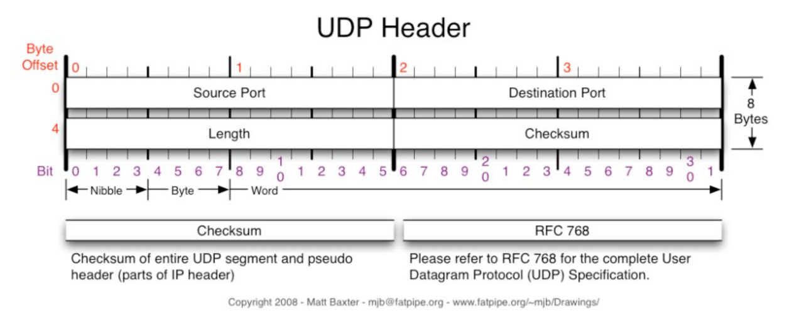

# PART : NETWORK

<!-- prettier-ignore-start -->
<!-- SOMETHING AUTO-GENERATED BY TOOLS - START -->

📄 참고자료 : [gyoogle/tech-interview-for-developer](https://github.com/gyoogle/tech-interview-for-developer)<br>
❓ [네트워크 면접 문제](/Question.md)

> 📇 목차<br><br>
[1. OSI 7 계층](#📡-1-osi-7-계층)<br>
[2. TCP 3 way handshake & 4 way handshake](#📡-2-tcp-3-way-handshake--4-way-handshake)<br>
[3. TCP/IP 흐름제어 & 혼잡제어](#📡-3-tcpip-흐름제어--혼잡제어)<br>
[4. UDP](#📡-4-udp)<br>
[5. 대칭키 & 공개키](#📡-5-대칭키--공개키)<br>

<!-- SOMETHING AUTO-GENERATED BY TOOLS - END -->
<!-- prettier-ignore-end -->

---

## 📡 1. OSI 7 계층

> 통신이 일어나는 과정을 단계별로 알 수 있고 특정한 곳에 이상이 생기면 그 단계만 수정할 수 있기 때문에 7계층으로 분리한다.

계층 단계


### 1) 물리 계층 (Physical)

주로 전기적, 기계적, 기능적인 특성을 이용하여 통신 케이블로 **데이터를 전송하는 역할.** 단지 데이터를 전달만 할 뿐 전송하려는 데이터가 무엇인지, 어떤 에러가 있는지는 신경 쓰지 않는다. <br />
ex) 리피터, 케이블, 허브 등

### 2) 데이터 링크 계층 (Datalink)

물리 계층으로 송수신되는 정보를 관리하여 안전하게 전달되도록 도와주는 역할. 물리적 주소인 Mac 주소를 통해 통신한다. 프레임에 Mac 주소를 부여하고 에러검출, 재전송, 흐름제어를 진행한다. <br />
포인트 투 포인트 간 신뢰성 있는 전송을 보장하기 위해 오류 제어와 흐름 제어가 필요하다. 네트워크 위의 개체들 간 데이터를 전달하고 물리 계층에서 발생할 수 있는 오류를 찾아내고 수정하는데 필요한 기능적, 절차적 수단을 제공한다. <br />
주소 값은 물리적으로 할당 받는데 주소 체계는 계층이 없는 단일구조이다.
ex) 브릿지, 스위치 등

### 3) 네트워크 계층 (Network)

데이터를 목적지까지 가장 안전하고 빠르게 전달하는 역할. 라우터를 통해 이동할 경로를 선택하여 IP 주소를 지정하고, 해당 경로에 따라 패킷을 전달해준다. 라우팅, 흐름 제어, 오류 제어, 세그멘테이션 등을 수행한다. 논리적인 주소 구조인 IP는 네트워크 관리자가 직접 주소를 할당하는 구조를 가지며 계층적이다. <br />
서브넷의 최상위 계층으로 경로를 설정하고 청구 정보를 관리한다. 개방형 시스템들의 사이에서 네트워크 연결을 설정, 유지, 해제하는 기능을 부여하고 전송 계층 사이에 네트워크 서비스 데이터 유닛을 교환하는 기능을 제공한다. <br />
ex) 라우터, IP

#### (1) IP 계층

IP 패킷의 전달 및 라우팅을 담당하는 계층.

- 역할 : 데이터링크 계층의 하드웨어적인 특성에 관계없이 독립적 역할을 수행
- 프로토콜 : 패킷의 전달을 책임지는 `IP`, 패킷 전달 에러의 보고 및 진단을 위한 `ICMP`, 복잡한 네트워크에서 인터네트워킹을 위한 경로를 찾게 해주는 `라우팅 프로토콜`

#### (2) IP 프로토콜

TCP/IP 기반의 인터넷 망을 통하여 데이터그램의 전달을 담당하는 프로토콜

- 기능 : Routing(IP 계층에서 IP 패킷의 라우팅 대상이 됨), Addressing(IP 주소 지정)
- 특징
  1. Best-Effort Service : 신뢰성 및 흐름제어 기능이 없음.
  2. Connectionless : 비연결성 데이터그램 방식으로 전달되는 프로토콜
  3. Unreliable : 패킷의 완전한 전달을 보장하지 않음.
  4. IPv4 / IPv6 헤더, IP 주소 : IP 패킷 헤더 내 수신 및 발신 주소를 포함
  5. Big-endian : 헤더 내 바이트 전달 순서
  6. IP 단편화 : 경우에 따라 단편화 필요
  7. TCP, UDP, ICMP, IGMP 등이 IP 데이터 그램에 실려서 전송.

### 4) 전송 계층 (Transport)

TCP와 UDP 프로토콜을 통해 통신을 활성화한다. 포트를 열어두고 프로그램들이 전송을 할 수 있도록 제공해준다. <br />
시퀀스 넘버 기반의 오류 제어 방식을 사용한다. 전송 계층은 특정 연결의 유효성을 제어하고, 일부 프로토콜은 상태 개념이 있으며 연결 기반이다. <br />
즉, 전송 계층이 패킷들의 전송이 유효한지 확인하고 전송 실패한 패킷들을 다시 전송한다는 것을 뜻한다.

#### (1) TCP 프로토콜

양종단 호스트 내 프로세스 상호 간에 신뢰적인 연결지향성 서비스를 제공.

- 신뢰성 : 패킷 손실, 중복, 순서 바뀜등이 없도록 보장.
- 연결지향적 : 양단간 어플리케이션 / 프로세스는 TCP가 제공하는 연결성 회선을 통하여 서로 통신

#### (2) UDP 프로토콜

가상회선을 굳이 확립할 필요가 없고 유연하며 효율적 응용의 데이타 전송에 사용.

- 비신뢰성, 비연결성 : 확인 응답, 순서 베어, 흐름제어, 오류 제어가 없다.
- 실시간 응용 및 멀티 캐스팅 가능 : 빠른 요청과 응답이 필요한 실시간 응용에 적합
- 단순한 헤더 : 헤더의 크기는 8 바이트 고정

### 5) 세션 계층 (Session)

데이터가 통신하기 위한 논리적 연결을 담당. 세션 설정, 유지, 종료, 전송 중단 시 복구 등의 기능이 있다. TCP/IP 세션을 만들고 없애는 책임을 지니고 있다. <br />
ex) API, Socket

### 6) 표현 계층 (Presentation)

데이터 표현에 대한 독립성을 제공하고 암호화 하는 역할 담당. 파일 인코딩, 명렁어 포장/압축/암호화를 한다. <br />
ex) JPEG, MPEG 등

### 7) 응용 계층 (Application)

최종 목적지로 응용 프로세스와 직접 관계하여 일반적인 응용 서비스를 수행. 사용자 인터페이스, 전자우편, 데이터베이스 관리 등의 서비스를 제공한다. <br />
ex) HTTP, FTP, DNS 등

---

## 📡 2. TCP 3 way handshake & 4 way handshake

> 연결을 성립하고 해제하는 과정

### 1) 3 way handshake - 연결 성립

TCP는 정확한 전송을 보장해야한다. 따라서 통신하기에 앞서 논리적인 접속을 성립하기 위해 3 way handshake 과정을 진행한다.


<진행과정>

1. 클라이언트가 서버에게 SYN 패킷을 보낸다.
2. 서버가 SYN(x)를 받고, 클라이언트로 받았다는 신호인 ACK와 SYN 패킷을 보냄.
3. 클라이언트는 서버의 응답은 ACK(x+1)와 SYN(y) 패킷을 받고, ACK(y+1)를 서버로 보냄.

### 2) 4 way handshake - 연결 해제

연결 성립 후, 모든 통신이 끝났다면 해제해야한다.


<진행 과정>

1. 클라이언트는 서버에게 연결을 종료한다는 FIN 플래그를 보냄.
2. 서버는 FIN을 받고, 확인했다는 ACK를 클라이언트에게 보냄.

- 모든 데이터를 보내기 위해 CLOSE_WAIT 상태

3. 데이터를 모두 보냈다면 연결이 종료되었다는 FIN 플래그를 클라이언트에게 보냄.
4. 클라이언트는 FIN을 받고 확인했다는 ACK를 서버에게 보냄.

- 아직 서버로부터 받지 못한 데이터가 있을 수 있으므로 TIME_WAIT을 통해 기다림.

5. 서버는 ACK를 받은 이후 소켓을 닫음.
6. TIME_WAIT 시간이 끝나면 클라이언트도 닫음.

---

## 📡 3. TCP/IP 흐름제어 & 혼잡제어

> `TCP 통신` : 네트워크 통신에서 신뢰적인 연결방식으로 신뢰성을 보장할 수 있도록 하는 프로토콜. network congestion avoidance algorithm을 사용.

**신뢰성 있는 네트워크를 보장한다는 것은 문제점이 존재한다는 의미.**

1. 손실 : 패킷이 손실될 수 있다.
2. 순서 바뀜 : 패킷의 순서가 바뀔 수 있다.
3. 혼잡 : 네트워크가 혼잡하다.
4. 오버로드 : 리시버가 오버로드 되는 문제

#### 전송의 전체 과정

1. 응용 계층에서 데이터를 전송할 때 보내는 쪽의 애플리케이션은 소켓에 데이터를 쓴다.
2. 이 때 데이터는 전송 계층으로 전달되어 세그먼트라는 작은 단위로 분할된다.
3. 전송 계층은 이 세그먼트를 네트워크 계층에 넘겨준다.
4. 전송된 데이터는 수신자 쪽으로 전달되어, 수신자 쪽에서는 수신 버퍼에 저장된다.
5. 이 때, 수신자 쪽에서는 수신 버퍼의 용량이 넘치지 않도록 조절해야한다.
6. 수신자 쪽에서는 자신의 수신 버퍼의 남은 용량을 상대방에게 알려주는데 이를 `수신 윈도우`라고 한다.
7. 송신자는 수신자의 수신 윈도우를 확인하여 수신자의 수신 버퍼 용량을 초과하지 않도록 데이터를 전송.
8. 이를 통해 데이터 전송 중에 수신 버퍼가 넘치는 현상을 방지하면서 안정적인 데이터 전송을 보장. => `플로우 컨트롤`

### 1) 흐름 제어 (Flow Control)

> `흐름제어` : 송신 측과 수신측의 데이터 처리 속도 차이를 해결하기 위한 기법. 수신 측이 송신 측 보다 데이터 처리 속도가 빠르면 문제 없지만 송신 측의 속도가 빠를 경우 문제가 생긴다. 수신 측에서 제한된 저장 용량을 초과한 이후에 도착하는 데이터는 손실될 수 있으며, 만약 손실된다면 불필요하게 응답과 데이터 전송이 송/수신간에 빈번히 발생한다. 이러한 위험을 줄이기 위하여 receiver가 패킷을 지나치게 많이 받지 않도록 조절하는 것이다. 기본 개념은 receiver가 sender에게 현재 자신의 상태를 feedback 한다는 점이다.

#### 해결방법 1. `Stop and Wait`

매번 전송한 패킷에 대해 확인 응답을 받아야만 그 다음 패킷을 전송하는 방법.

#### 해결방법 2. `Sliding Window`

수신 측에서 설정한 윈도우 크기만큼 송신측에서 확인 응답 없이 세그먼트를 전송할 수 있게 하여 데이터 흐름을 동적으로 조절하는 제어기법


- 목적 : 전송은 되었지만 acked(확인응답)를 받지 못한 byte의 숫자를 파악하기 위해 사용하는 프로토콜.

  ```
  LastByteSend(마지막에 보내진 바이트) - LastByteAcked(마지만에 확인된 바이트) <= ReceivedWindowAdvertised(남아있는 공간)
  ```

- 동작 방식 : 먼저 윈도우에 포함되는 모든 패킷을 전송하고, 그 패킷들의 전달이 확인되는대로 윈도우를 옆으로 옮김으로써 그 다음 패킷들을 전송

  - window : TCP/IP를 사용하는 모든 호스트들은 송신하기 위한 것과 수신하기 위한 2개의 window를 가지고 있다. 호스트들은 실제 데이터를 보내기 전에 3 way handshaking을 통해 수신 호스트의 receice window size에 자신의 send window size를 맞추기 된다.

- 세부 구조

  1. 송신 버퍼 <br />
     

  - 200 이전의 바이트는 이미 전송되었고 acked를 받은 상태.
  - 200 - 202 바이트는 전송 되었으나 acked을 받지 못한 상태
  - 203 -211 바이트는 아직 전송이 되지 않은 상태

    <br />

  2. 수신 윈도우 <br />
     

     <br />

  3. 송신 윈도우 <br />
     

  - 수신 윈도우보다 작거나 같은 크기로 송신 윈도우를 지정하기 되면 흐름제어가 가능.

    <br />

  4. 송신 윈도우 이동 <br />
     

  - Before : 203 - 204를 전송하면 수신 측에서는 acked 203을 보내고 송신측은 이를 받아 after 상태와 같이 수신 윈도우를 203-209 범위로 이동
  - After : 205 - 209가 전송 가능한 상태

    <br />

  5. seleced repeat

### 2) 혼잡 제어 (Congestion Control)

> 송신측의 데이터 전달과 네트워크의 데이터 처리 속도 차이를 해결하기 위한 기법. 송신 측의 데이터는 지역망이나 인터넷으로 연결된 대형 네트워크를 통해 전달된다. 만약 한 라우터에 데이터가 몰릴 경우, 자신에게 온 데이터를 모두 처리할 수 없게 된다. 이런 경우 호스트들은 다시 재전송을 하게 되고 결국 혼잡만 가중시켜 오버플로우나 데이터 손실을 발생시킨다. 따라서 이러한 네트워크의 혼잡을 피하기 위해 송신측에서 보내는 데이터의 전송 속도를 강제로 줄이게 되는데 이러한 작업을 혼잡제어라고 한다. <br />
> 또한 네트워크 내에서 패킷의 수가 과도하게 증가하는 현상을 혼잡이라고 하며, 혼잡 현상을 방지하거나 제거하는 기능을 혼잡제어라고 한다.

`흐름제어`가 송신측과 수신측 사이의 전송속도를 다루는 반면, `혼잡제어`는 호스트와 라우터를 포함한 보다 넓은 관점에서 전송 문제를 다루게 된다.


#### 해결 방법 1. AIMD (Additive Increase / Multiplicative Decrease)

> 처음에 패킷을 하나씩 보내고 이것이 문제없이 도착하면 window 크기(단위 시간 내에 보내는 패킷의 수)를 1씩 증가시켜가며 전송하는 방법.

- 패킷 전송에 실패하거나 일정 시간을 넘으면 패킷의 보내는 속로를 절반으로 줄인다.
- 공평한 방식 : 여러 호스트가 한 네트워크를 공유하고 있으면 나중에 진입하는 쪽이 처음에는 분리하지만 시간이 흐르면 평형상태로 수렴
- 문제점 : 초기에 네트워크의 높은 대역폭을 사용하지 못하여 오랜 시간이 걸리게 되고, 네트워크가 혼잡해지는 상황을 미리 감지하지 못한다. 네트워크가 혼잡해지고 나서야 대역폭을 줄이는 방식

#### 해결 방법 2. Slow Start

> AIMD와 마찬가지로 패킷을 하나씩 보내면서 시작하고 패킷이 문제 없이 도착하면 각각의 ACK 패킷마다 window size를 1씩 증가시킨다. 즉, 한 주기가 끝나면 window size가 2배가 된다.

- 전송 속도 : AIMD에 반해 지수함수꼴로 증가. 대신, 혼잡 현상 발생 시 window size를 1로 떨어뜨림.
- 처음에는 네트워크 수용량을 예상할 수 있는 정보가 없지만 한 번 혼잡현상이 발생하고 나면 네트워크의 수용량을 어느정도 예상 할 수 있다.
- 따라서 혼잡현상이 발생하였던 window size의 절반까지는 이전처럼 지수함수꼴로 창 크기를 증가시키고 그 이후부터는 완만하게 1씩 증가시킨다.

#### 해결방법 3. Fast Retransmit

> TCP의 혼잡 조절에 추가된 정책

- 패킷을 받는 쪽에서 먼저 도착해야할 패킷이 도착하지 않고 다음 패킷이 도착한 경우에도 ACK 패킷을 보내게 된다.
- 단, 순서대로 잘 도착한 마지막 패킷의 다음 패킷의 순번을 ACK 패킷에 실어서 보내게 되므로 중간에 하나가 손실되게 되면 송신 측에는 순번이 중복된 ACK 패킷을 받게 된다. 이것을 감지하는 순간 문제가 되는 순번의 패킷을 재전송 해줄 수 없다.
- 중복된 순번의 패킷을 3개 받으면 재전송을 하게 된다. 약간 혼잡한 상황이 일어난 것이므로 혼잡을 감지하고 window size를 줄이게 된다.

#### 해결방법 4. Fast Recovery

- 혼잡한 상태가 되면 window size를 1로 줄이지 않고 반으로 줄이고 선형증가시키는 방법이다. 이 정책까지 적용하면 혼잡 상황을 한번 겪고 나서부터는 순수한 AIMD 방식으로 동작하게 된다.

---

## 📡 4. UDP

> User Datagram Protocol은 데이터를 데이터그램 단위로 처리하는 프로토콜이다. 비연결성, 신뢰성 없는 전송 프로토콜로 데이터 그램 단위로 쪼개면서 전송을 하는 전송 계층에서 사용하는 프로토콜이다.

#### TCP와 UDP의 등장 배경

IP의 역할은 Host to Host만을 지원한다. 장치에서 장치로의 이동은 IP로 해결되지만 하나의 장비 안에서 수많은 프로그램들이 통신을 할 경우, IP만으로는 한계가 있다. <br />
=> 포트 번호 탄생

또한 IP에서 오류가 발생한다면 ICMP에서 알려준다. 하지만 ICMP는 알려주미남 할 뿐 대처를 못하기 때문에 IP보다 위에서 처리를 해줘야한다. <br />
=> TCP와 UDP 탄생

- ICMP : 인터넷 제어 메시지 프로토콜로 네트워크 컴퓨터 위에서 돌아가는 운영체제에서 오류 메시지를 전송받는데 주로 사용

#### 오류 해결 방법

1. TCP : 데이터의 분실, 중복, 순서가 뒤바뀜 등을 자동으로 보정해줘서 송수신 데이터의 정확한 전달을 할 수 있도록 해준다.
2. UDP : IP가 제공하는 정도의 수준만을 제공하는 간단한 IP 상위 계층의 프로토콜. TCP와는 다르게 에러가 날 수도 있고 재전송이나 순서가 뒤바뀔 수도 있어서 이 경우, 어플리케이션에서 처리하는 번거로움이 존재

### 1) UDP 사용 이유

- 데이터의 신속성 : 데이터 처리가 TCP 보다 빠르다.
- 주로 실시간 방송과 온라인 게임에서 사용

#### DNS 에서 UDP를 사용

> `DNS(Domain Name System)` : 웹 사이트에 접속할 때 우리는 외우기 어려운 IP 주소 대신 도메인 이름 사용. 도메인 이름을 사용했을 때 입력한 도메인을 실제 네트워크 상에서 사용하는 IP 주소로 바꾸고 해당 IP 주소로 접속하는 과정을 DNS 라고 한다.

DNS는 어플리케이션 계층의 프로토콜로 모든 어플리케이션 계층의 프로토콜은 TCP/UDP 중 하나의 전송 계층 프로토콜을 사용해야한다. 이 때, TCP를 사용하게 되면 데이터를 송신할 때까지 세션 확립을 위한 처리를 하고 송신한 데이터가 수신 되었는지 점검하는 과정이 필요하므로 프토코롱 오버헤드가 UDP에 비해서 크다.

<사용 이유>

1. Request 양이 적어 UDP Request에 담길 수 있다.
2. 3 way handshaking으로 연결을 유지할 필요가 없다. (오버헤드 발생)
3. Request에 대한 손실은 어플리케이션 꼐층에서 제어가 가능하다.
4. DNS : port 53번

**TCP를 사용하는 경우**

- Zone Transfer을 사용해야하는 경우
  - Zone Transfer : DNS 서버 간의 요청을 주고 받을 때 사용하는 transfer
- 크기가 512 byte를 넘어갈 때

### 2) UDP 헤더


4가지 구성 요소가 각각 16비트 길이를 이룬다. 따라서 UDP 헤더의 길이는 총 64비트이다.

#### 구성

1. Source Port : 출발지 포트. 출발지 포트 번호 정보를 갖고 있다.
2. Destination Port : 목적지 포트. 목적지 포트 번호 정보를 갖고 있다.
3. Length : 길이. 응용 계층에서 생성한 UDP 페이로드와 전송 계층에서 생성한 UDP 헤더가 더해진 데이터그램 길이 정보. 오류 검사 항목은 일반적으로 비활성 상태. 그러나 TCP/IP 소켓을 개발을 경우 오류검사 항목의 활성 상태와 비활성 상태에 따라 데이터그램의 모습이 다르다.

- 오류 검사 항목 비활성 상태 : UDP 페이로드 - UDP 헤더
- 오류 검사 항목 활성 상태 : UDP 페이로드 - UDP 헤더 - 가상 헤더(96비트)

4. Checksum : 헤더와 데이터를 모두 포함한 사용자 데이터그램 전체에 대한 오류를 탐지하기 위하여 사용된다. 송신된 자료의 무결성 보호.

#### 특징

- TCP 보다 용량이 가볍고 송신 속도가 빠르게 작동.
- 확인 응답은 불가 -> 신뢰도는 떨어짐
- UDP는 비연결성, TCP는 연결성으로 정의

---

## 📡 5. 대칭키 & 공개키

### 1) 대칭키(Symmetric Key)

> 암호화와 복호화에 같은 암호키(대칭키)를 사용하는 알고리즘

동일한 키를 주고받기 때문에 매우 빠름.
해킹 위험에는 취약함.

### 2) 공개키(Public Key)/비대칭키(Asymmetric Key)

> 암호와와 복호화에 사용하는 암호키를 분리한 알고리즘

대칭키의 키 분배 문제를 해결하기 위해 고안됨. <br />
이 경우, 남들이 알아도 되는 공개키면 공개하면 된다. <br />
자신이 가지고 있는 고유한 암호키(비밀키)로만 복호환 할 수 있는 암호키(공개키)를 대중에게 공개.

#### 공개키 암호와 진행 방식

1. A가 웹 상에 공개된 B의 공개키를 이용해 평문을 암호화 하여 B에게 전송
2. B는 자신의 비밀키로 복호화된 평문을 확인, A의 공개키로 응답을 암호화하여 A에게 보냄.
3. A는 자신의 비밀키로 암호화된 응답문을 복호화함.

**이 방식은 기밀성만 보장, 확실성과 진실성은 보장해주지 못함.**

=> MAX이나 전자서명으로 해결. 대칭키에 비해 암호화 복호화가 복잡하다. (암호와하는 키가 복호화하는 키와 서로 다르기 때문)

#### 하이브리드 방식

> 대칭키를 주고 받을 떄만 공개키 암호화 방식을 사용, 이후에는 대칭키 암호화 방식으로 통신 (SSL 탄생의 시초 )

1. A가 B의 공개키로 암호화 통신에 사용할 대칭키를 암호화하고 B에게 보냄
2. B는 암호문을 받고, 자신의 비밀키로 복호화함
3. B는 A로부터 얻은 대칭키로 A에게 보낼 평문을 암호화하여 A에게 보냄
4. A는 자신의 대칭키로 암호문을 복호화함
5. 앞으로 이 대칭키로 암호화를 통신함

---
