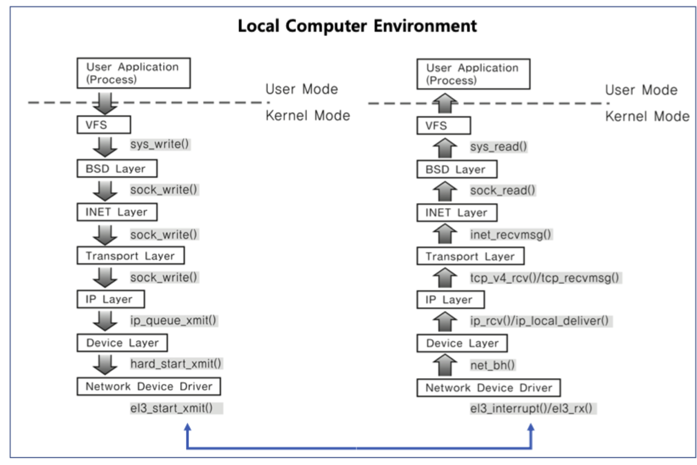
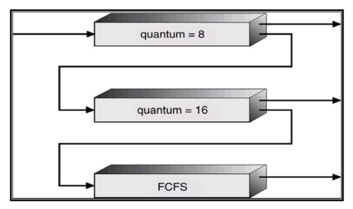

# CS_STUDY

<!-- prettier-ignore-start -->
<!-- SOMETHING AUTO-GENERATED BY TOOLS - START -->

📄 참고자료 : [gyoogle/tech-interview-for-developer](https://github.com/gyoogle/tech-interview-for-developer)<br>
❓ [스터디에서 뽑은 면접 문제](/Question.md)

> 📇 목차<br><br>
[1. 운영체제](#🖥️-1-운영체제)<br>
 &emsp; [1) 의미](#1-의미)<br> 
 &emsp; [2) 역할](#2-역할)<br> 
 &emsp; [3) 프로세스와 스레드](#3-프로세스와-스레드)<br> 
 &emsp; [4) 프로세스의 주소공간](#4-프로세스의-주소-공간)<br>
 &emsp; [5) 인터럽트 (Interrupt)](#5-인터럽트-interrupt)<br> 
 &emsp; [6) System Call](#6-system-call)<br>
 &emsp; [7) PCB와 Context Switching](#7-pcb와-context-switching)
 &emsp; [8) IPC(Inter Process Communication)](#8-ipcinter-process-communication) <br>
 &emsp; [9) CPU 스케줄링](#9-cpu-스케줄링)<br>
 &emsp; [10) 데드락(DeadLock)](#10-데드락deadlock)<br>
 &emsp; [11) Race Condition](#11-race-condition)<br>
 &emsp; [12) 세마포어(Semaphore) & 뮤텍스(Mutex)](#12-세마포어semaphore--뮤텍스mutex)<br>

<!-- SOMETHING AUTO-GENERATED BY TOOLS - END -->
<!-- prettier-ignore-end -->

## 🖥️ 1. 운영체제

---

### 1) 의미

**사용자가 컴퓨터를 편리하고 효과적으로 사용할 수 있도록 환경을 제공하는 시스템 소프트웨어**

하드웨어를 관리하고 컴퓨터 시스템의 자원들을 효율적으로 관리하며, 응용프로그램과 하드웨어 간의 인터페이스로써 다른 응용 프로그램이 유용한 작업을 할 수 있도록 환경을 제공한다.<br>
<span style="color:gray">
(ex) Windows, Linux, UNIX, MS-DOS
</span>

---

### 2) 역할

#### (1) 프로세스 관리

**운영체제에서 작동하는 응용 프로그램을 관리하는 기능**<br>
CPU를 점유해야 할 프로세스를 결정하고 실제로 CPU를 프로세스에 할당하며 프로세스 간 공유 자원 접근과 통신 등을 관리

- 프로레스, 스레드
- 스케줄링
- 동기화
- IPC 통신

#### (2) 저장장치 관리

: **메인 메모리(1차 저장장치)와 하드디스크, NAND(2차 저장장치) 등을 관리하는 기능**

| 1차 저장장치                                      | 2차 저장장치                                                       |
| ------------------------------------------------- | ------------------------------------------------------------------ |
| 프로세스에 할당하는 메모리 영역의 할당과 해제     | 파일 형식의 데이터 저장                                            |
| 각 메모리 영역간의 침범 방지                      | 파일 데이터 관리를 위한 파일 시스템을 OS에서 처리                  |
| 메인 메모리의 효율적 활용을 위한 가상 메모리 기능 | `FAT, NTFS, EXT2, JFS, XFS`등 많은 파일 시스템들이 개발되어 사용중 |

- 메모리 관리
- 가상 메모리
- 파일 시스템

#### (3) 네트워킹

: **TCP/IP 기반의 인터넷에 연결하거나 응용 프로그램이 네트워크를 사용하려면 운영체제에서 네트워크 프로토콜을 지원**<br>
현재 상용 OS들은 다양하고 많은 네트워크 프로토콜 지원. <br>
OS는 HW를 운영 및 관리하고 명령어를 제어하며 응용프로그램 및 HW를 SW적으로 제어 및 관리해야함.

- TCP/IP
- 기타 프로토콜

#### (4) 사용자 관리

: **각 계정을 관리할 수 있는 기능 필요** <br>
사용자 별로 프라이버시와 보안을 위해 개인 파일에 대해선 다른 사용자가 접근할 수 없도록 해야한다.<br>
파일이나 시스템 자원에 접근 권한을 지정할 수 있도록 지원

- 계정 관리
- 접근권한 관리

#### (5) 디바이스 드라이버

: **하드웨어를 추상화 해주는 계층**<br>
하드웨어의 종류가 많은 만큼 운영체제 내부의 디바이스 드라이버도 많이 존재하며, 이러한 수많은 디바이스 드라이버들을 관리하는 기능 또한 운영 체제가 담당

- 순차접근 장치
- 임의접근 장치
- 네트워크 장치

---

### 3) 프로세스와 스레드

> 참고자료<br> > [[tistory Inpa Dev] 프로세스와 스레드](https://inpa.tistory.com/entry/%F0%9F%91%A9%E2%80%8D%F0%9F%92%BB-%ED%94%84%EB%A1%9C%EC%84%B8%EC%8A%A4-%E2%9A%94%EF%B8%8F-%EC%93%B0%EB%A0%88%EB%93%9C-%EC%B0%A8%EC%9D%B4)

#### 의미

**프로세스** : 프로그램을 메모리상에서 실행중인 작업<br>
**스레드** : 프로세스 안에서 실행되는 여러 흐름 단위

- 각 프로세스마다 최소 1개의 스레드 소유 (메인 스레드 포함)

#### (1) 프로세스

**각각 별도의 주소공간을 독립적으로 할당받음**

- `Code` : 코드 자체를 구성하는 메모리 영역(프로그램 명령)
- `Data` : 전역 및 정적 변수, 배열 등
  - 초기화 된 데이터는 data 영역에 저장
  - 초기화 되지 않은 데이터는 bss 영역에 저장
- `Heap` : 동적 할당 시 사용 (new(), amlloc() 등)
- `Stack` : 지역변수, 매개변수, 리턴 값(임시 메모리 영역)

#### (2) 스레드

**Stack만 따로 할당 받고 나머지 영역은 서로 공유**

- Stack 영역만 따로 할당받는 이유
  - 스레드는 독립적인 동작을 수행하기 위해 존재
  - 독립적으로 함수를 호출하기 위해 함수의 매개변수, 지역변수 등을 저장하는 스택 메모리 영역은 독립적으로 할당받아야 함.

> ➡️ 프로세스는 자신만의 고유 공간과 자원을 할당 받아 사용 vs 스레드는 다른 스레드와 공간, 자원을 공유하면서 사용

#### (3) 멀티 프로세스

**하나의 프로그램을 여러개의 프로세스로 구성하여 각 프로세스가 병렬적으로 작업을 수행하는 것**
|장점|단점|
|---|---|
|안전성 : 메모리 침범 문제를 OS 차원에서 해결|오버헤드 발생 : 각각 독립된 메모리 영역을 갖고 있어 작업량 많을수록 오버헤드|
||Conext Switching으로 인한 성능저하|

- Context Switching이란?<br>
  **프로세스의 상태정보를 저장하고 복원하는 일련의 과정**
  - 동작중인 프로세스가 대기하면서 해당 프로세스의 상태를 보관하고 대기하고 있던 다음 순번의 프로세스가 동작하면서 이전에 보관했던 프로세스 상태를 복구하는 과정

#### (4) 멀티 스레드

**하나의 응용 프로그램에서 여러 스레드를 구성해 각 스레드가 하나의 작업을 처리하는 것(고유 메모리를 통하여)**
|장점|단점|
|---|---|
|시간 및 자원 손실의 감소 : 공유 메모리이므로 시간 및 손실 감소|안전성 문제 : 하나의 스레드가 데이터 공간을 망가뜨리면 모든 스레드가 작동 불능 상태(공유 메모리를 갖기 때문)|

- Critical Section 기법 : 멀티스레드의 안전성 대비
  - 하나의 스레드가 공유 데이터 값을 변경하는 시점에 다른 스레드가 그 값을 읽으려할 때발생하는 문제를 해결하기 위한 동기화 과정
  - 상호 배제, 진행, 한정된 대기를 충족해야함.

---

### 4) 프로세스의 주소 공간

**프로그램이 CPu에 의해 실행되면 프로세스가 생성되고 메모리에 `프로세스 주소 공간`이 할당**<br><br>
구성 : **코드 Segment, 데이터 Segment, 스택 Segment**

- 코드 Segment : 프로그램 소스 코드 저장
- 데이터 Segment : 전역 변수 저장
- 스택 Segment : 함수, 지역 변수 저장

```
<이렇게 구역을 나누는 이유>

최대한 데이터를 공유하여 메모리 사용량을 줄여야 하기 때문.
Code는 같은 프로그램 자체에서는 모두 같은 내용이기 떄문에 따로 관리하여 공유
Stack과 데이터를 나눈 이유는, 스택 구조의 특성과 전역 변수의 활성을 위한 것

프로그램의 함수와 지역 변수는, LIFO(가장 나중에 들어간게 먼저 나옴)특성을 가진 스택에서 실행된다.
따라서 이 함수들 안에서 공통으로 사용하는 '전역 변수'는 따로 지정해주면 메모리를 아낄 수 있다.
```

---

### 5) 인터럽트 Interrupt

**프로그램을 실행하는 도중에 예기치 않은 상황이 발생할 경우 현재 실행 중인 작업을 즉시 중단하고, 발생된 상황에 대한 우선 처리가 필요함을 CPU에게 알리는 것**<br>
지금 수행 중인 일보다 더 중요한 일이 발생하면 그 일을 먼저 처리하고 나서 하던 일을 계속해야한다.

#### (1) 외부 인터럽트

- 발생 원인 : CPU의 하드웨어 신호(외부적인 요인)<br>
  <span style="color:gray">
  (ex) 입출력 장치, 타이밍 장치, 전원 이상, 기계 착오 등
  </span>

#### (2) 내부 인터럽트 (Trap)

- 발생 원인 : CPU의 하드웨어 신호(잘못된 명령이나 데이터를 사용할 때 발생)<br>
  <span style="color:gray">
  (ex) 0으로 나누기, 오버플로우, 잘못된 명령어 등
  </span>

#### (3) 소프트웨어 인터럽트

- 발생 원인 : 프로그램 처리 중 명령의 요청에 의해 발생한 것 (SVC 인터럽트)<br>
  <span style="color:gray">
  (ex) 사용자가 프로그램을 실행시킬 때 발생. 소프트웨어 이용 중에 다른 프로세스를 실행시키면 시분할 처리를 위해 자원 할당 동작이 수행
  </span>

#### 인터럽트 발생 처리 과정


1. 주 프로그램이 실행되다가 인터럽트가 발생
2. 현재 수행중인 프로그램을 멈추고 상태 레지스터와 PC 등을 스택에 잠시 저장<br>
   <span style="color:gray">
   잠시 저장하는 이유 : 인터럽트 서비스 루틴이 끝난 뒤 다시 원래 작업으로 돌아와야 하기 때문
   </span>

3. 인터럽트 서비스 루틴으로 이동

<br>

**인터럽트 기능이 없었다면**

> 컨트롤러는 특정한 어떤 일을 할 시기를 알기 위해 계속 체크(`Polling`)<br>
> 폴링을 하는 시간에는 원래 하던 일에 집중할 수 없게 되어 많은 기능을 제대로 수행하지 못하는 단점 有

#### 컨트롤러가 입력을 받아들이는 방법(우선순위 판별 방법)

1. `폴링 방식` : 사용자가 명령어를 사용해 입력 핀의 값을 계속 읽어 변화를 알아내는 방식

- 인터럽트 요청 플래그를 차례로 비교하여 우선순위가 가장 높은 인터럽트 자원을 찾아 이에 맞는 인터럽트 서비스 루틴 수행
- 단점 : 인터럽트가 많을 경우 하드웨어에 비해 느린 속도

2. `인터럽트 방식` : MCU 자체가 하드웨어적으로 변화를 체크하여 변화 시에만 일정한 동작을 하는 방식 <br><span style="color:gray">ex) Daisy Chain : 인터럽트가 발생하는 모든 장치를 한 개의 회선에 직렬로 연결하며, 우선순위가 높은 장치를 맨 앞에 위치시키며 우선순위에 따라 연결한다.<br> 병렬 우선순위 부여 : 각 장치마다 별개의 회선으로 연결한다. 인터럽트 요청을 제어하기 위해 Mask Register를 사용한다.</span><br>

- 제약 : 하드웨어로 지원을 받아야함
- 장점 : 폴링에 비해 신속한 대응 가능 => **실시간 대응** 시 유리

⭐ 인터럽트는 발생시기를 예측하기 힘든 경우에 컨트롤러가 가장 빠르게 대응할 수 있는 방법

---

### 6) System Call

**프로세스 생성과 제어를 위한 시스템 콜 : `fork()`, `exec()`, `wait()`**

#### (1) fork()

**새로운 프로세스를 생성할 때 사용**<br>
<span style="color:gray">그러나 이상한 방식</span>

```
#include <stdio.h>
#include <stdlib.h>
#include <unistd.h>

int main(int argc, char *argv[]) {
    printf("pid : %d", (int) getpid()); // pid : 29146

    int rc = fork();					// 주목

    if (rc < 0) {
        exit(1);
    }									// (1) fork 실패
    else if (rc == 0) {					// (2) child 인 경우 (fork 값이 0)
        printf("child (pid : %d)", (int) getpid());
    }
    else {								// (3) parent case
        printf("parent of %d (pid : %d)", rc, (int)getpid());
    }
}
```

> 출력값 <br>
> pid : 29146<br>
> parent of 29147 (pid : 29146) <br>
> child (pid : 29147) <br> <span style="color:gray">child와 parent의 출력 순서는 스케줄러가 결정하는 일로 확신할 수 없음</span>

- PID : 프로세스 식별자. UNIX 시스템에서는 PID는 프로세스에겨 명령을 할 때 사용

`fork()`가 실행되는 순간 프로세스가 하나 더 생기는데, 이 때 생긴 프로세스(Child)는 fork를 만든 프로세스(Parent)와 거의 동일한 복사본을 갖게 된다. 이때 OS는 위와 똑같은 2개의 프로그램이 동작한다고 생각하고 `fork()`가 return 될 차례라고 생각한다. 그 때문에 새로 생성된 Process(child)는 `fork()`까지 된 기억이 있기 때문에 main에서 시작하지 않고 if문부터 시작하게 된다.

parent와 child 프로세스의 차이점 : `fork()값이 다르다`

> Parent의 fork 값 === Child의 fork 값<br>
> Child의 fork 값 === 0

#### (2) wait()

**child 프로세스가 종료될 때까지 기다리는 작업**

```
#include <stdio.h>
#include <stdlib.h>
#include <unistd.h>
#include <sys/wait.h>

int main(int argc, char *argv[]) {
    printf("pid : %d", (int) getpid()); // pid : 29146

    int rc = fork();					// 주목

    if (rc < 0) {
        exit(1);
    }									// (1) fork 실패
    else if (rc == 0) {					// (2) child 인 경우 (fork 값이 0)
        printf("child (pid : %d)", (int) getpid());
    }
    else {								// (3) parent case
        int wc = wait(NULL)				// 추가된 부분
        printf("parent of %d (wc : %d / pid : %d)", wc, rc, (int)getpid());
    }
}
```

> 출력값 <br>
> pid : 29146<br>
> child (pid : 29147) <br>
> parent of 29147 (wc : 29147 / pid : 29146) <br>

`wait()`를 통해서 child의 실행이 끝날 때까지 기다린다. parent가 먼저 실행되더라도 `wait()`는 child가 끝날 때까지 return 하지 않아 반드시 child가 먼저 실행된다.

#### (3) exec()

**child에서는 parent와 다른 동작을 하고 싶을 때 exec() 사용**

```
#include <stdio.h>
#include <stdlib.h>
#include <unistd.h>
#include <sys/wait.h>

int main(int argc, char *argv[]) {
    printf("pid : %d", (int) getpid()); // pid : 29146

    int rc = fork();					// 주목

    if (rc < 0) {
        exit(1);
    }									// (1) fork 실패
    else if (rc == 0) {					// (2) child 인 경우 (fork 값이 0)
        printf("child (pid : %d)", (int) getpid());
        char *myargs[3];
        myargs[0] = strdup("wc");		// 내가 실행할 파일 이름
        myargs[1] = strdup("p3.c");		// 실행할 파일에 넘겨줄 argument
        myargs[2] = NULL;				// end of array
        execvp(myarges[0], myargs);		// wc 파일 실행.
        printf("this shouldn't print out") // 실행되지 않음.
    }
    else {								// (3) parent case
        int wc = wait(NULL)				// 추가된 부분
        printf("parent of %d (wc : %d / pid : %d)", wc, rc, (int)getpid());
    }
}
```

`exec()` 실행 과정

1. `execvp(실행 파일, 전달인자)`는 code segment 영역에 실행 파일의 코드를 읽어와서 덮어 씌운다.
2. heap, stack, 다른 메모리 영역이 초기화 된다.
3. OS는 그냥 실행한다.

새로운 프로세스를 생성하지 않고 현재 프로그램에 wc라는 파일을 실행한다. 따라서 `execep()` 이후의 부분은 실행되지 않는다.

#### (4) abort()

**프로세스를 비자발적으로 종료할 때 사용**

- 부모 프로세스가 자식 프로세스를 강제로 종료한다.
  - 자식 프로세스가 한계를 넘어서는 자원 요청
  - 자식에게 할당된 task가 더 이상 필요하지 않음
- 키보드로 kill, break 등을 입력한 경우
- 부모가 종료하는 경우
  - 부모 프로세스가 종료하기 전에 자식들이 먼저 종료됨

---

### 7) PCB와 Context Switching

#### (1) PCB의 의미

**프로세스 메타데이터들을 저장해 놓는 곳.**

- 한 PCB 안에는 한 프로세스의 정보가 담김

> **프로세스 메타데이터**란? <br> Process Management (CPU가 프로세스가 여러개 일 때 CPU 스케줄링을 통해 관리하는 것) 를 할 때, 각 프로세스를 구분하기 위해 프로세스의 특징을 갖고 있는 데이터 <br> - Process ID <br> - Process State <br> - Process Priority <br> - CPU Registers <br> - Owner <br> - CPU Usage <br> - Memory Usage

- 구성
  
  1. 포인터 : 프로세스의 현재 위치 저장
  2. 프로세스 상태 : 각 상태 저장 (`New`, `Ready`, `Running`, `Waiting`, `Terminated`)
  3. 프로세스 번호 : 프로세스 식별자를 저장하는 고유한 ID
  4. 프로그램 카운터 : 프로세스를 위해 실행될 다음 명령어의 주소를 포함하는 카운터 저장
  5. 레지스터 : 누산기, 베이스, 레지스터 및 범용 레지스터를 포함하는 CPU 레지스터에 있는 정보
  6. 메모리 제한 : 사용하는 메모리 관리 시스템에 대한 정보 포함
  7. 열린 파인 목록

#### (2) PCB의 과정

1. 프로그램 실행
2. 프로세스 생성
3. 프로세스 주소 공간 (코드, 데이터 스택) 생성
4. 프로세스의 메타데이터들의 PCB에 저장

#### (3) PCB의 필요성

**프로세스 상태관리와 Context Switching을 위해 필요**

CPU에서는 interrupt가 발생해서 할당받은 프로세스가 waiting 상태가 되고 다른 프로세스를 running으로 바꿔 올릴 때 프로세스의 상태에 따라 교체작업이 이루어진다. 이 때, 앞으로 다시 수행할 대기 중인 프로세스에 관한 저장 값을 PCB에 저장해둔다.

#### (4) PCB의 관리 방법

**`LinkedList` 방식**
PCB List Head에 PCB들이 생성될 때마다 붙는다. 즉, 프로세스가 생성되면 해당 PCB가 생성되고 프로세스 완료 시 제거된다.PCB의 삽입 삭제가 용이하다.

**접근 방식 : 프로세스 테이블 사용**


빠른 접근을 위해 프로세스 테이블을 사용한다.

#### (5) Context Switching [문맥교환]

- 의미 : CPU가 이전의 프로세스 상태를 PCB에 보관하고 또 다른 프로세스의 정보를 PCB에 읽어 레지스터에 적재한느 과정
- 발생 상황
  1. 인터럽트 발생
  2. 실행 중인 CPU 사용 시간을 모두 소모
  3. 입출력을 위해 대기해야하는 경우

⭐ 프로세스가 Ready -> Running / Running -> Ready / Running -> Waiting 처럼 상태 변경 시 발생

#### (6) Context Switching의 과부하

프로세스 작업 중에는 overhead를 감수해야하는 상황이 존재.

> 프로세스를 수행하다가 입출력 이벤트가 발생 -> 대기 상태로 전환 -> CPU가 놀지 않도록 다른 프로세스를 수행시키기

CPU에 계속 프로세스를 수행시키도록 하기 위해서 다른 프로세스를 실행시키고 Context Switching을 하는 것.
CPU가 놀지 않도록 만들고 사용자에게 빠르게 일처리를 제공해주기 위한 것.

---

### 8) IPC(Inter Process Communication)

- [추가 참고 자료](https://velog.io/@redgem92/%EC%9A%B4%EC%98%81%EC%B2%B4%EC%A0%9C-IPC-%EA%B8%B0%EB%B2%95)

#### (1) 의미

**Inter-Process Communication 의 약자로 독립적 구조를 가진 프로세스 간의 통신을 가능하게 해주는 것**

- 프로세스들은 독립되어 있기 때문에 별도 설비 없이는 프로세스 상호간의 통신이 어려움
- 하나의 프로그램이지만 여러 프로세스 간의 협력이 필요한 경우가 있음
  1. 특정 Task를 여러 개의 Sub Task로 나누어 더 빠르게 수행해야하는 경우
  2. 동시에 많은 Task를 한 번에 처리해야하는 경우
- 프로세스 간의 통신이 필요한 경우를 위해 운영체제 `커널영역`에서 IPC 제공

> 커널이란? <br>
> 운영 체제의 색심적인 부분으로 다른 모든 부분에 여러 기본적인 서비스 제공하고 여러가지 하드웨어 등의 리소스를 관리하는 역할 <br> > [📌 커널 참고 자료](https://minkwon4.tistory.com/295)

#### (2) IPC 종류

1. 익명 파이프

- 파이프는 두 개의 프로세스를 연결하는데 하나의 프로세스는 데이터를 쓰기만 하고 하나는 읽기만 한다.
- 한쪽 방향으로만 통신이 가능한 반 이중 통신
- 양쪽으로 모두 송/수신을 하고 싶으면 2개의 파이프를 만들어야한다.
- 통신할 프로세스를 명확히 알 수 있는 경우에 사용
- 장점 : 간단하게 사용, 단순한 데이터 흐름을 가질 떄 사용
- 단점 : 전이중 통신을 위해 2개를 만들어야할 때, 복잡한 구현

2. Named Pipe (FIFO)

- 전혀 모르는 상태의 프로세스들 사이 통신에 사용
- 부모 프로세스와 무관한 다른 프로세스도 통신 가능 (통신을 위해 이름 있는 파일 사용)
- 읽기/쓰기 동시에 불가능
- 전이중 통신을 위해서는 2개의 파이프를 만들어야함

3. Message Queue

- FIFO 정책으로 데이터가 전송되는 기법
- 데이터 흐름이 아닌 메모리 공간
- 사용할 데이터에 번호를 붙이면서 여러 프로세스가 동시에 데이터를 쉽게 다룰 수 있다.
- 장점 : 메시지 큐에 쓸 데이터에 번호를 붙임으로써 여러개의 프로세스가 동시에 데이터를 쉽게 다룰 수 있다.

4. 공유 메모리

- 커널 공간에 메모리 공간을 만들고 해당 공간을 변수처럼 쓰는 방식
- 메모리 주소를 변수처럼 접근해서 사용
- 공유 Key를 통해 여러 프로세스가 접근을 가능하게 한다.
- **중개자 없이 곧바로 메모리에 접근할 수 있어서 IPC 중에 가장 빠르게 작동**

5. 메모리 맵

- 공유메모리와 마찬가지로 메모리를 공유
- 열린 파일을 메모리에 맵핑시켜서 공유
- 장점 : 데이터가 메모리에 이미 올라와있는 것처럼 간단하게 접근할 수 있음, 일반적인 파일 IO에 비해 나은 성능, 비동기 IO를 사용하지만 시스템에서 처리해주기 떄문에 스레드 문제를 걱정할 필요 없다.
- 단점 : 일반 파일 IO에 비해 상당히 많은 메모리를 요구, 많은 데이터를 얼마나 오랫동안 메모리에 둘 것인지 컨트롤 불가

6. 소켓

- 많이 쓰이는 기법
  > 소켓이란? <br> 네트워크 통신을 위한 기술.
- 소켓을 활용하면 로컬 컴퓨터 간의 통신 시 계층을 타고 내려가면서 송신을 하고 아래 계층부터 위로 올라가서 대상 프로세스가 수신
  

⭐ IPC 통신에서 프로세스 간 데이터를 동기화하고 보호하기 위해 [세마포어와 뮤텍스](#12-세마포어semaphore--뮤텍스mutex) 사용

---

### 9) CPU 스케줄링

**운영체제는 CPU를 프로세스 간에 교환함으로써 컴퓨터를 보다 생산적으로 만든다.**<br>
최신 운영체제에서는 커널 수준 쓰레드를 스케줄

- 조건 : 오버헤드 ⬇️ | 사용률 ⬆️ | 기아현상 ⬇️
- 목표
  1. Batch System : 가능한 많은 일을 수행. 시간 < 처리량
  2. Interactice System : 빠른 응답 시간, 적은 대기 시작
  3. Real-Time System : 기한 맞추기

#### (1) 선점/비선점 스케줄링

1. `선점 스케줄링` : OS가 CPU의 사용권을 선점할 수 있는 경우, 강제 회수하는 경우 (처리시간 예측 어려움)

- Priority Scheduling
  - 정적/동적으로 우선순위를 부여하여 우선순위가 높은 순서대로 처리
  - 우선 순위가 낮은 프로세스가 무한정 기다리는 Starvation이 생길 수 있음
  - Aging 방법으로 Starvation 문제 해결 가능
- Round Robin
  - FCFS에 의해 프로세스들이 보내지면 각 프로세스는 동일한 시간의 타임 퀀텀(실행의 최소 단위 시간 / 타임 슬라이스)만큼 CPU를 할당 받음
  - 할당 시간이 크면 FCFS와 같게 되고 작으면 문백 교환이 잦아져서 오버헤드 증가
- Multilevel-Queue (다단계 큐)

  - 작업들을 여러 종류의 그룹으로 나누어 여러개의 큐를 이용하는 기법
  - 우선순위가 낮은 큐들이 실행 못하는걸 방지하고자 각 큐마다 다른 타임 퀀텀을 설정해주는 방식 사용
  - 우선순위가 높은 큐는 작은 타임퀀텀 할당. 우선순위가 낮은 큐는 큰 타임 퀀텀 할당

  

2. `비선점 스케줄링` : 프로세스 종료 or IO 등의 이벤트가 있을 때까지 실행 보장 (처리시간 예측 용이)

- FCFS (First Come First Served)
  - 큐에 도착한 순서대로 CPU 할당
  - 실행시간이 짧은 게 뒤로 가면 평균 대기 시간이 길어짐
- SJF (Shortest Job First)
  - 수행 시간이 가장 짧다고 판단되는 작업을 먼저 수행
  - FSFC 보다 평균 대기 시간 감소, 짧은 작업에 유리
- HRN (Highest Response-radio Next)
  - 우선순위를 계산하여 점유 불평등을 보완한 방법 (SJF의 단점 보완)
  - 우선순위 = (대기시간 + 실행시간) / 실행시간

#### (3) CPU 스케줄링 척도

- ResponseTime : 작업이 처음 실행되기까지 걸린 시간
- Turnaround Time : 실행 시간과 대기 시간을 모두 합한 시간으로 작업이 완료될 때까지 걸린 시간

---

### 10) 데드락(DeadLock)

**두 개 이상의 프로세스나 스레드가 서로 자원을 얻지 못해서 다음 처리를 하지 못하는 상태**

- 시스템적으로 한정된 자원을 여러 곳에서 사용하려고 할 때 발생하는, 무한히 다음 자원을 기다리게 되는 상태

#### (1) 데드락이 일어나는 경우

**예시**

> 프로세스 1과 2가 자원 1,2를 모두 얻어야하는 상황 <br> 1. P1이 R1를 얻음, P2가 R2를 얻음 <br> 2. P1은 R2를 기다림 / P2는 R1을 기다림

=> 현재 서로 원하는자원이 상대방에 할당되어 있어서 두 프로세스는 무한정 wait 상태에 빠짐

**주로 발생하는 경우**<br>

1. 멀티 프로그래밍 환경에서 한정된 자원을 얻기 위해 서로 경쟁한은 상황 발생
2. 한 프로세스가 자원을 요청했을 때, 동시에 그 자원을 사용할 수 없는 상황이 발생할 수 있음. 이때 프로세스는 대기 상태로 들어감.
3. 대기 상태로 들어간 프로세스들이 실행 상태로 변경될 수 없을 때 교착상태 발생

#### (2) 데드락 발생 조건

하나라도 성립하지 않으면 데드락 문제 해결 가능

1. Mutual Exclutsion (상호 배제)<br>
   : 자원은 한 번에 한 프로세스만 사용할 수 있음

2. Hold and Wait (점유 대기)<br>
   : 최소한 하나의 자원을 점유하고 있으면서 다른 프로세스에 할당되어 사용하고 있는 자원을 추가로 점유하기 위해 대기하는 프로세스가 존재해야함

3. No Preemption (비선점) <br>
   : 다른 프로세스에 할당된 자원은 사용이 끝날 때까지 강제로 뺴앗을 수 없음

4. Circular Wait (순환 대기) <br>
   : 프로세스의 집합에서 순환 형태로 자원을 대기하고 있어야 함

#### (3) 데드락 처리

1. 교착 상태 예방 & 최피

- 예방 : 교착 상태 발생 조건 중 하나를 제거하면서 해결 (자원 낭비 발생)

  - `상호배제 부정` : 여러 프로세스가 공유 자원 사용
  - `점유대기 부정` : 프로세스 실행전 모든 자원을 할당
  - `비선점 부정` : 자원 점유 중인 프로세스가 다른 자원을 요구할 때 가진 자원 반납
  - `순환대기 부정` : 자원에 고유번호 할당 후 순서대로 자원 요구

- 회피 : 교착 상태 발생 시 피해나가는 방법
  - `은행원 알고리즘` (Bancker's Algorithm)
    > 은행에서 모든 고객의 요구가 충족되도록 현금을 할당하는데서 유래한 알고리즘으로 프로세스가 자원을 요구할 때 시스템은 자원을 할당한 후에도 안정 상태로 남아있게 되는지 사전에 검사하여 교착 상태를 회피한다. 안정상태면 자원을 할당하고 그렇게 않다면 다른 프로세스들의 자원 해지까지 대기한다.
  - `자원 할당 그래프 알고리즘` (Resource-Allocation Graph Algorithm)
    > 자원과 프로세스에 대해 요청 간선과 할당 간선을 적용하여 교착상태를 회피하는 알고리즘으로 프로세스가 자원을 요구 시 요청 간선을 할당 간선으로 변경했을 때 사이클이 생성되는지 확인한다. 사이클이 생성된다 하여 무조건 교착상태인 것은 아니다. <br> 자원에 하나의 인스턴스만 존재 시 교착 상태로, 자원에 여러 인스턴스가 존재 시 교착 상태 가능성으로 판별한다. <br> 사이클을 생성하지 않으면 자원을 할당한다.

2. 교착 상태를 탐지 & 회복

- 탐지 : 자원 할당 그래프를 통해 교착 상태를 탐지. 자원 요청 시, 탐지 알고리즘을 실행시켜 그에 대한 오버헤드 발생

- 회복 : 교착 상태 일으킨 프로세스를 종료하거나, 할당된 자원을 해제시켜 회복시키는 방법
  - `프로세스 종료 방법` : 교착상태의 프로세스를 모두 중지, 교착 상태가 제거될 떄까지 하나씩 프로세스 중지
  - `자원 선점 방법` : 교착 상태의 프로세스가 점유하고 있는 자원을 선점해 다른 프로세스에게 할당 (해당 프로세스 일시정지 시킴), 우선 순위가 낮은 프로세스나 수행 횟수 적은 프로세스 위주로 프로세스 자원 선점

---

### 11) Race Condition

**공유 자원에 대해 여러 프로세스가 동시에 접근할 때 결과값에 영향을 줄 수 있는 상태**

- 두 개의 스레드가 하나의 자원을 놓고 서로 사용하려고 경쟁하는 상황
- 동시 접근 시 자료의 일관성을 해치는 결과가 나타남

#### (1) Race Condition이 발생하는 경우

1. 커널 작업을 수행하는 중에 인터럽트 발생

- 문제점 : 커널 모드에서 데이터를 로드하여 작업을 수행하다가 인터럽트가 발생하여 같은 데이터를 조작하는 경우
- 해결법 : 커널모드에서 작업을 수행하는 동안 인터럽트를 disable 시켜 CPU 제어권을 가져가지 못하도록 한다.

2. 프로세스가 'System Call'을 하여 커널모드로 진입하여 작업을 수행하는 도중 문맥 교환이 발생할 때

- 문제점 : 프로세스1이 커널모드에서 데이터를 조작하는 도중, 시간이 초과되어 CPI 제어권이 프로세스2로 넘어가 같은 데이터를 조작하는 경우 (프로세스2가 작업에 반영되지 않음)
- 해결법 : 프로세스가 커널모드에서 작업을 하는 경우 시간이 초과되어도 CPU 제어권이 다른 프로세스에게 넘어가지 않도록 함.

3. 멀티 프로세서 환경에서 공유 메모리 내의 커널 데이터에 접근할 때

- 문제점 : 멀티 프로세서 환경에서 2개의 CPU가 동시에 커널 내부의 공유 데이터에 접근하여 조작하는 경우
- 해결법 : 커널 내부에 있는 각 공유 데이터에 접근할 때마다 그 데이터에 대한 lock/unlock을 하는 방법

#### (2) 해결 방법

**동기화**

- 쓰레드의 순차적 실행을 보장해주면 된다.<br>

`critical section (임계구역)`

- 경쟁상태가 발생할 수 있는 코드의 조각들
- 쓰레드 또는 프로세스 간 공유하고 있는 변수가 있는 코드 조각
- 요구 조건 : 상호배제, 진행, 한계대기
  - 상호 배제 : 하나의 자원에는 하나의 프로세스만 접근할 수 있어야한다.
  - 진행 : 임계 구역이 비었으면 자원을 사용할 수 있어야 한다.
  - 한계 대기 : 존버하면 언젠가는 임계구역에 진입할 수 있어야한다.

`Critical Section Problem`

- 임계 구역에서 경쟁상태가 발생한 것
- 해결 방안 : [세마포어, 뮤텍스](#12-세마포어semaphore--뮤텍스mutex)

---

### 12) 세마포어(Semaphore) & 뮤텍스(Mutex)
